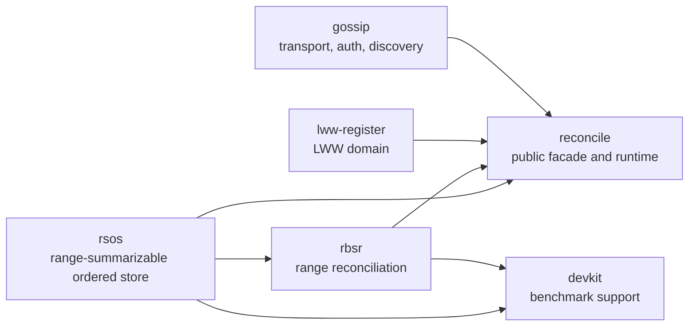

# Architecture

This document describes repository-wide structure and invariants. Public API semantics belong in
rustdoc; security properties belong in [`SECURITY.md`](SECURITY.md).

## 1. System

`reconcile` is an embedded, fully replicated map. Each authoritative replica stores the complete
dataset. Reads are local; writes are propagated eagerly and repaired by range-based anti-entropy.

Values use last-write-wins ordering. Deletions are tombstones until causal-stability tracking permits
garbage collection. Persistence is optional; a durable backend restores values, tombstones, and
causal-stability state before the node rejoins the protocol.

`ReadReplicaMap` is a non-authoritative, value-only replica. It consumes the same reconciliation
protocol but does not originate authoritative values or participate in tombstone stability.

## 2. Workspace

| crate | responsibility |
|---|---|
| `rsos` | ordered storage, range aggregates, canonical fingerprint input |
| `rbsr` | transport-independent range reconciliation |
| `lww-register` | entries, timestamps, clocks, persistence contracts |
| `gossip` | datagram transport, wire codec, authentication, replay protection, discovery |
| `reconcile` | replicated maps/sets, lifecycle, persistence adapters, observability |
| `devkit` | unpublished benchmark utilities |

### 2.1 Domain boundary

`rsos`, `rbsr`, and `lww-register` do not depend on runtime, network, wire-codec, or wall-clock
infrastructure. `gossip` owns network concerns; `reconcile` composes domain and adapters.

`gossip` does not depend on `lww-register`: its peer identity is an address and its payload is
bytes.

### 2.2 Snapshots

`FingerprintTreeMap` is persistent: unchanged nodes are structurally shared through `Arc`.
`ReplicatedMap` and `ReadReplicaMap` publish immutable roots through `ArcSwap`. Point reads and
snapshots therefore do not hold the writer lock.

## 3. Runtime boundaries

The main ports are:

| port | owner | adapters |
|---|---|---|
| `Rsos` / `RsosView` | `rsos` / `rbsr` | `FingerprintTreeMap` |
| `Clock` | `lww-register` | `HlcClock` |
| `Persistence` | `lww-register` | in-memory, file snapshot, downstream implementations |
| `Transport` | `gossip` | UDP, in-memory, network-emulation decorator |
| `Discovery` | `gossip` | random probing, DNS |

Authentication and replay validation happen before wire messages reach reconciliation logic.
Malformed or unauthenticated network input must not mutate domain state.

## 4. Global invariants

- A replica is fully replicated, not sharded.
- Same-key conflicts use the total order defined by `Timestamp`; merge is deterministic.
- Range equality compares both aggregate cardinality and fingerprint.
- Reconciliation policies are local choices; they are not negotiated on the wire.
- A split must make progress. Non-progressing policy output is converted to enumeration.
- Read replicas are sinks: they do not become authoritative sources or causal-stability members.
- Tombstones are collected only after the active authoritative membership has acknowledged them.
- Persisted state is loaded before network participation.
- Authenticated traffic is verified before deserialization and protocol handling.
- Wire versions are strict; incompatible versions do not communicate.

Type-level and function-level forms of these rules are documented next to the APIs that enforce
them.
