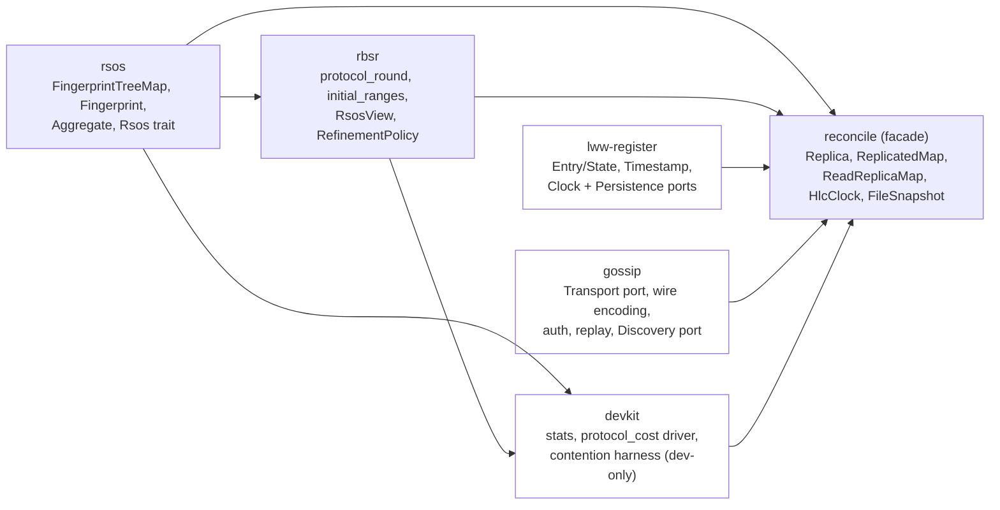
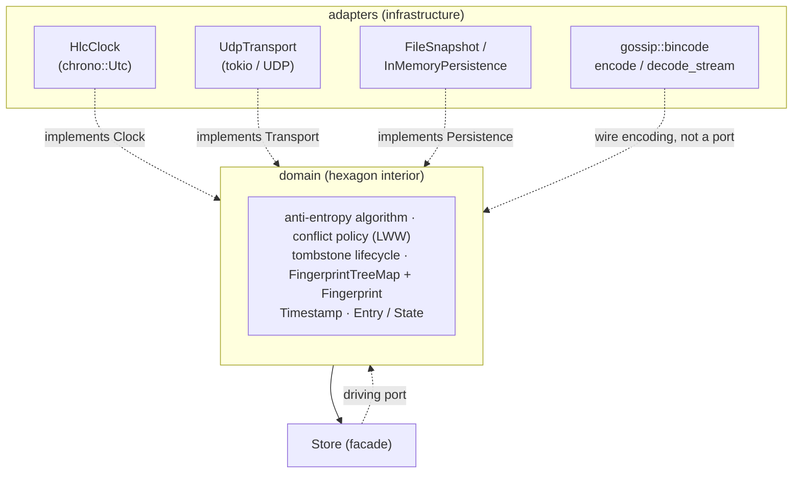
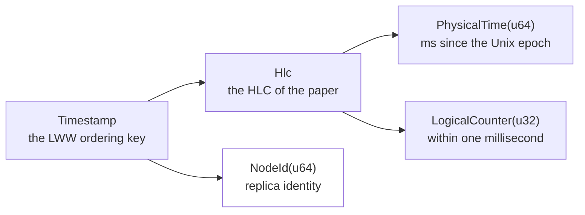
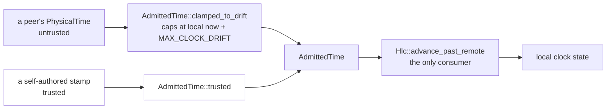

# reconcile-rs — Architecture

## Status & scope

`reconcile-rs` is a reconciliation service that keeps a key-value map synchronised across several
instances. This document describes the architecture as it stands today — a completed hexagonal
(ports & adapters) split into five crates. Correctness and security properties are tracked below
(§8); state-of-the-art positioning is in [`POSITIONING.md`](./POSITIONING.md). Code locations are given as
`file:line` against the current tree.

The public API and the on-wire / on-disk formats are pre-1.0 and may change. Only `reconcile` is
published, and that published version predates this workspace split — current publish status and
the release gate list are tracked live by the `v1.0.0` milestone and
[issue #206](https://github.com/Akvize/reconcile-rs/issues/206), which owns the plan and the
reasoning.

---

## 1. System overview

A node holds an ordered key-value map and gossips changes to its peers so that all replicas
converge. Five mechanisms:

- **Storage** — `FingerprintTreeMap`: an ordered map that also maintains, for every subtree, a
  **range fingerprint**, so the hash of any key interval is available in `O(log n)`.
- **Anti-entropy protocol** — two peers compare aggregates over shrinking key ranges (`rbsr`'s
  `protocol_round`) and exchange only the entries that actually differ. Equality and emptiness are
  decided by interval **size**, not by hash, to stay collision-safe. *How* a range is refined —
  when to stop splitting and how wide to cut — is a `RefinementPolicy`, a purely local choice that
  never reaches the wire (§3.1); the default splits into the paper's constant `b` = 16.
- **Causality & conflict resolution** — each value is stamped with a Hybrid Logical Clock timestamp
  (`Timestamp`); conflicts resolve by **last-write-wins** over the HLC total order
  `(physical, logical, node_id)`.
- **Deletion** — removals are **tombstones**, garbage-collected only once causally stable (every
  monotonic cluster member has acknowledged the exact version), which prevents resurrection.
- **Transport & security** — messages travel as authenticated UDP datagrams (per-datagram MAC,
  verified before deserialisation). Persistence to disk is optional.

---

## 2. Crates and modules



`gossip` deliberately does **not** depend on `lww-register`: nothing in transport/auth/replay/
discovery knows what an `Entry`, `Timestamp` or `Key` is — a datagram is a byte slice, a peer is an
address. `reconcile` is the one place the two meet.

`devkit --> reconcile` is a **dev-dependency** edge only: `benches/protocol.rs`/`contention.rs`
consume it, the `reconcile` library itself never does — see §2.1.

| Crate | Holds | Kind |
|---|---|---|
| `rsos` | `fingerprint_tree_map{,_iter}.rs`, `fingerprint.rs`, `encoding.rs`, `aggregate.rs`, `rsos_trait.rs` | leaf, zero workspace deps |
| `rbsr` | `protocol.rs` (the driver), `policy.rs` (the refinement-policy seam), `rsos_view.rs` | depends on `rsos` only |
| `lww-register` | `entry.rs`, `bounds.rs`, `clock.rs` (`Hlc`/`Timestamp`/`Clock`), `persistence.rs` (`Persistence`/`PersistedState`) | **domain**, infrastructure-free |
| `gossip` | `transport.rs`, `bincode.rs`, `auth.rs`, `replay.rs`, `discovery.rs`, `gen_ip.rs` | infrastructure; no `lww-register` dep |
| `devkit` | `stats.rs` (bootstrap statistics), `protocol_cost.rs` (`Cost`/`Counting`/`reconcile` driver), `contention.rs` (N-writer harness) | dev/bench-only, never published (#524); depends on `rsos`/`rbsr` only |
| `reconcile` | `replica.rs`, `replicated_map.rs`, `read_replica_map.rs`, `clock.rs` (`HlcClock` adapter), `snapshot.rs` (`FileSnapshot`), `observability.rs`, `prometheus.rs`, `timeout_wheel.rs` | facade; depends on all four, re-exports their public types under `reconcile::*` |

`reconcile` keeps re-export shims (`src/persistence.rs`, `src/clock.rs`, `pub use` in `src/lib.rs`)
so `reconcile::entry::Entry`, `reconcile::transport::UdpTransport`, `reconcile::FileSnapshot` and
friends resolve unchanged for existing consumers. `FileSnapshot` briefly had its own crate
(`snapshot`) and was folded back into `reconcile` as `src/snapshot.rs`: a single type with no reuse
value outside this workspace does not earn a crate boundary the way `rsos`/`rbsr` (genuinely
reusable) or `lww-register`/`gossip` (compiler-enforced purity, §2.1) do.

### 2.1 Domain purity

`lww-register`'s manifest declares exactly one dependency, `serde`'s derive — no async runtime,
socket, wire codec or wall clock can be imported there; the build fails rather than the boundary
rotting. `rsos` and `rbsr` carry the same guarantee via their own minimal manifests. This is the
interior of the hexagon, and it exists today, gated by `./scripts/check-domain-purity.sh`
(mechanics: AGENTS.md §9). `gossip` and `reconcile` are adapters and carry infrastructure
dependencies by design. `devkit` is neither domain nor adapter — a dev/bench-only sibling the check
does not cover at all (not in its manifest list, not shipped, #524) — the same exemption `gossip`
and `reconcile` already have, for the same reason: nothing here is claiming purity for it.

---

## 3. Ports & adapters

### 3.1 Principle

The domain — storage, protocol, causality, conflict resolution, tombstone lifecycle — depends only
on a small set of **ports** (traits) it defines itself. **Adapters** implement those ports against
concrete infrastructure. All dependency arrows point inward: adapters depend on the domain, never
the reverse. Ports are public and reveal intent; mechanism (how a diff round is computed, how a
range hash is queried) stays internal to its owning crate.



### 3.2 Ports

Four outbound ports, each removing one concrete infrastructure dependency from the domain:

| Port | Crate | Replaces | Adapter(s) |
|---|---|---|---|
| `Clock` | `lww-register/src/clock.rs` | direct `chrono::Utc` read | `HlcClock` (`src/clock.rs`) |
| `Transport` | `gossip/src/transport.rs` | `tokio::net::UdpSocket` | `UdpTransport`, `InMemoryTransport`; dev-only decorators over either — `CountingTransport` (`benches/system.rs`), `NetemTransport` (`gossip/src/netem/`, `netem` feature: seeded delay/jitter/loss/reordering, #280) |
| `Persistence` | `lww-register/src/persistence.rs` | ad hoc file I/O | `FileSnapshot`, `InMemoryPersistence` |
| `Discovery` | `gossip/src/discovery.rs` | inline IP-scan | `RandomProbe` (speculative), `DnsDiscovery` (authoritative) |

`Clock` returns the concrete `Timestamp` rather than a generic associated type: it is the only stamp
in use, and the tombstone wheel and wire format are already coupled to its shape. `Transport` is
`#[async_trait]` and object-safe (`Arc<dyn Transport>`), fixed to `SocketAddr` rather than carrying
a generic `Addr` — every call site hard-wired that anyway, so the associated type was dead freedom
(#287). `InMemoryTransport`/`InMemoryNetwork` are public (not test-gated) so downstream crates can
drive a deterministic in-process cluster in their own tests. `Discovery::discover` reports failure
as a boxed `DiscoveryError`, so an implementor is free to define a richer error taxonomy
(`DnsDiscovery`'s `DnsDiscoveryError` distinguishes a resolver failure from a lookup that blew its
timeout budget) without giving up the `Arc<dyn Discovery>` trait object every call site relies on.
`Discovery::kind` distinguishes a speculative probe result (steers only the current round's targets)
from an authoritative one (seeded into the known-peer set, an absence decommissions after a grace
period) — either way discovery never grants causal-stability membership (§5 invariant 6), which a
peer must earn via an authenticated dated datagram.

**Wire encoding is not a port.** `gossip::bincode::{encode, decode_stream}` are plain `pub fn`s (no
trait, no adapter type) — the crate owns exactly one implementation and has no test-driven need for a
second (`bincode.rs`'s own tests call them directly, no fake). `decode_stream` carries a `max_items`
cap so one datagram cannot be expanded into an unbounded number of messages. Authentication
(`Authenticator`/MAC) wraps the codec externally, verified on raw bytes before any decoding runs
(§5 invariant 5) — never folded in.

**`RefinementPolicy` is a strategy, not a port.** `rbsr::RefinementPolicy` is a trait, and every
port here is a trait, but it removes no infrastructure dependency: it sits *inside* the hexagon and
varies a domain decision — for one active range, SKIP, IDLIST or SPLIT, and how wide a SPLIT cuts.
It earns a seam for a different reason than a port does: the choice is **purely local and never
negotiated**. A peer answers whatever segmentation it is asked about, `RangeAggregate` carries no
policy, and Proposition 4.1's soundness argument uses only that a SPLIT's children are pairwise
disjoint with union the parent — which `protocol_round` guarantees regardless of policy. So two
peers running *different* policies converge (`tests/proptest_fingerprint_tree_map/diff_convergence.rs`'s
`convergence_holds_under_any_policy_and_any_mixed_pair`, and `rbsr`'s own
`peers_running_different_policies_still_converge`), which is what makes swapping one cheap.
Advertising or negotiating a policy would turn that free experiment into a protocol break, and is
the one thing this seam must never grow ([#257](https://github.com/Akvize/reconcile-rs/issues/257)).

**`Clock` injection ([#288](https://github.com/Akvize/reconcile-rs/issues/288), decided: open it).**
`Clock` was a published port with zero public implementors and no injection seam — advertising a
capability that did not exist. Resolved by opening it:
`ReplicatedMap::new_with_clock`/`Replica::new_with_clock` accept any `Arc<dyn Clock>`, and
`lww_register::clock::assert_conformance` (re-exported as `reconcile::clock::assert_conformance`)
is the conformance harness an implementor runs before trusting a substitute clock — monotonicity is
a runtime property of an arbitrary implementation, not something the type system can gate, so a
runtime check an implementor must run is the closest thing to a gate available. `Clock::observe_trusted`
has no default body (previously delegated to `observe`, sound only for a clamp-free adapter): every
implementor now states its clamp policy explicitly. Both constructors' rustdoc carries the full risk
writeup — what a non-monotonic `now()`, an `observe` not chased by `now() > t`, or a clamping
`observe_trusted` each silently break.

**Visibility.** `Clock`/`Transport`/`Persistence`/`Discovery` are public ports on their owning
crate. What the mechanism behind them exposes, and to whom:

| item | `pub` on | re-exported by `reconcile` |
|---|---|---|
| `Clock` / `Transport` / `Persistence` / `Discovery` | owning crate | yes — the ports are the seam |
| `rank` / `select` / `range` | `rsos` | no |
| `protocol_round` / `protocol_round_with_policy` / `initial_ranges` | `rbsr` | no |
| `RangeAggregate` / `EnumerationRange` / `RoundOutcome` / the `RefinementPolicy` seam | `rbsr` | no |
| `bincode::{encode, decode_stream}` | `gossip` | no |

The right-hand column is not an oversight: `rsos` and `rbsr` are published-intent, reusable crates
(AGENTS.md §11), so their primitives are `pub` for a consumer depending on them directly, while
`reconcile`'s own surface stays the facade. `gossip::bincode` is `pub` for the narrower reason that
`reconcile` must reach it across a crate boundary.

Two consequences follow, and both are decisions rather than accidents:

| | |
|---|---|
| Injecting a `RefinementPolicy` is an `rbsr`-level operation | `reconcile`'s `Config` is `Copy` (the fixed-size `nets` array exists to keep it so), which a boxed or borrowed policy would break. What the facade should expose wants the measured comparison first — `POSITIONING.md` §2.2 |
| `Codec` was considered and dissolved as a trait | one implementation; no object-safety need (its methods are generic, always carried as a type parameter); no plausible second use — compression interacts with authenticate-before-decode, and cross-language interop needs a published wire spec, not a Rust trait |

---

## 4. Domain types and conflict policy

A single, intention-revealing type represents a stored cell:

```rust
pub struct Entry<T, V> { pub stamp: T, pub state: State<V> }
pub enum State<V> { Present(V), Tombstone }

impl<T: Ord + Copy, V: Clone> Entry<T, V> {
    pub fn is_tombstone(&self) -> bool { matches!(self.state, State::Tombstone) }
    pub fn value(&self) -> Option<&V> { /* … */ }
    pub fn merge(&self, other: &Self) -> Self {        // last-write-wins (strict >)
        if other.stamp > self.stamp { other.clone() } else { self.clone() }
    }
}
```

`Entry::project(&self) -> State<V>` gives the timestamp-less value-only projection `ReadReplicaMap`
converges over — `State<V>` already has no `Timestamp` field, so no field-by-field summary of it can
include one (§5 invariant 8).

`T` is, in practice, always `Timestamp` — built from newtypes and split along the seam between
*reading a clock* and *ordering writes*:

```rust
pub struct Hlc { physical: PhysicalTime, logical: LogicalCounter }  // the HLC of the paper
pub struct Timestamp { hlc: Hlc, node_id: NodeId }                  // the LWW ordering key
pub struct PhysicalTime(u64);    // HLC physical time: an instant, ms since the Unix epoch
pub struct LogicalCounter(u32);  // HLC logical counter, within one millisecond
pub struct NodeId(u64);          // replica identity — the deterministic tie-break
pub struct ClockDrift(u64);      // a *duration*, never comparable to an instant
```



The split is where it is because a Hybrid Logical Clock (Kulkarni et al. 2014) *is* the pair
`(physical, logical)` — `node_id` is the tie-break that makes the LWW comparison total, not a clock
component. Two consequences:

| | |
|---|---|
| the arithmetic (`Hlc::next_tick`, `Hlc::advance_past_remote`) lives on `Hlc` and takes no `NodeId` | the `Clock` adapter owns the identity and attaches it only when minting a `Timestamp`, so it is stored once rather than as both a field and part of a stored clock reading |
| nesting costs nothing on the wire | bincode and `rsos`'s canonical encoding (§6) both write a struct as its fields in declaration order with no framing, so `{{physical, logical}, node_id}` is byte-identical to a flat triple — pinned by `tests/timestamp_wire_format.rs` |

`Timestamp` is built through one further "parse, don't validate" type, `AdmittedTime` — the past
participle is the point: the type is evidence the drift check *has run*. There are exactly two ways
in, and `Hlc::advance_past_remote` accepts nothing else, so the clamp is a property of the type
system rather than of a parameter name (§5 invariant 6 depends on this):



That clamp guards the *local clock state* only — a remote stamp is stored verbatim, since it is LWW
data. `reconcile::clock`'s `BoundedInstant` performs the one further derivation that needs bounding:
the tombstone-expiry instant, re-admitting the stored `PhysicalTime` through the same
`clamped_to_drift` seam against local now (`reconcile`'s `HlcClock` adapter, since it needs both a
physical-time read and a `chrono` instant — the domain crate has neither).

`Entry` and `AdmittedTime` are the same "parse, don't validate" shape as
[`Payload`](gossip/src/auth.rs) (only obtainable via `Authenticator::open`): construction of an
invalid instance is either structurally impossible or funneled through one fallible constructor.

Conflict resolution is **domain policy**, not a port: last-write-wins is the concrete default. A
pluggable `Resolve` seam is warranted only if a second policy (e.g. a CRDT) becomes a real
requirement.

### 4.1 Generic bounds

```rust
pub trait Key:   Clone + Debug + Ord + Send + Sync + Serialize + DeserializeOwned + 'static {}
pub trait Value: Clone + Debug + Send + Sync + Serialize + DeserializeOwned + 'static {}
```

Neither bundle carries `Hash` (fingerprints derive from `Serialize` via `rsos::encoding`, §6, not
`std::hash::Hash` — which `HashMap`/`HashSet` don't implement at all) or `PartialEq` (the receive
path's only "did this change?" question is a stamp comparison, `Entry::merge` returns `other` exactly
when the remote stamp is strictly greater, so `Timestamp: Ord` answers it without ever comparing —
or cloning — the value). The remaining `Hash` bounds in the facade are genuine `HashMap`-key
requirements, spelled out locally where the `HashMap` is (`ReplicatedMap`/`Replica`'s peer and
tombstone indexes, `TimeoutWheel`, the snapshot codec).

---

### 4.2 State typing

A finite, named set of states carried by a **type** rather than by an `Option`, a `bool` or a bare
primitive, so the state is a compile-time fact instead of call-site discipline. AGENTS.md §4 states
the rule; these are its worked instances, and the reference examples to copy:

| Type | What its existence proves | Obtained by |
|---|---|---|
| `Entry` / `State<V>` (`lww-register`) | a dated cell vs its timestamp-less projection (§5 inv. 8) | `Entry::project` |
| `StartBound` / `EndBound` (`rbsr`) | the two bound shapes the protocol emits — the other two `Bound` variants fail to deserialize rather than reaching the driver | wire decode |
| `Payload<Authenticated>` / `Payload<Verified>` (`gossip`) | MAC-checked, then replay-checked; message handling takes `Verified`, so an unchecked datagram cannot reach it | `Payload::verify_replay` |
| `AdmittedTime` (`lww-register`) | a peer's physical time was clamped to the drift budget before touching local clock state | `AdmittedTime::clamped_to_drift` |

**Newtype or phantom parameter?** Decide by whether the *pre*-state travels. `Payload` earns its
parameter: both states are held, passed, and demanded in a signature. `AdmittedTime` does not — its
raw form is consumed where it is produced, so a phantom would add a type parameter to every
signature to distinguish a state nothing carries. Prefer the newtype until a second state is
genuinely held across a boundary.

The 2026-08 sweep for this pattern is closed. Both items it left open have since been resolved in
the direction it recommended: `Authenticator`'s `is_enabled`/`is_encrypted` booleans are gone (call
sites `match` the enum, which was already a well-typed state), and `Discovery::is_authoritative() ->
bool` became `kind() -> DiscoveryKind`.

---

## 5. Invariants

Load-bearing properties preserved across any change; they encode the correctness and security
guarantees whose resolution history §8 tracks.

1. **Fingerprint format & arithmetic** — `[u64; 4]`, per-element BLAKE3 over `rsos::encoding`'s
   injective byte encoding (not `std::hash::Hash`, whose byte sequences Rust does not stabilize —
   and which `HashMap`/`HashSet` don't implement), add/sub mod 2²⁵⁶. Both halves are load-bearing:
   changing the encoding is as much a wire break as changing the hash. Golden vectors in
   `rsos/src/fingerprint.rs`. On the wire, `Serialize`/`Deserialize` go through raw `[u8; 32]` rather
   than deriving over the four `u64` limbs — a uniformly random 256-bit value gets nothing from
   `bincode`'s default varint integer encoding except a length byte per incompressible limb (#382,
   decided before the wire freeze).
2. **HLC total order** `(physical, logical, node_id)` — merge uses strict `>`. Composed of two
   derived orders, `Hlc` over `(physical, logical)` then `Timestamp` over `(hlc, node_id)`; the
   newtype declaration order *is* the conflict order, and `tests/timestamp_wire_format.rs` pins that
   neither the newtype wrapping nor the `Hlc` nesting costs anything on the wire.
3. **Size-not-hash emptiness/equality** in `protocol_round` (`rbsr/src/protocol.rs`) — owned by
   `Comparison::agrees`, so a swapped `RefinementPolicy` cannot re-derive it wrongly.
4. **Malformed-bound / inverted-range hardening** in `protocol_round`.
5. **Authenticate before deserialise** — the MAC is verified on raw bytes before the codec runs;
   `decode_stream` never absorbs authentication.
6. **Causal-stability tombstone gate** — a tombstone is garbage-collected only after every monotonic
   cluster member has acknowledged the exact version hash. `Discovery` only ever feeds the
   gossip-target `peers` set, **never** the `members` set: membership is earned solely by an
   authenticated dated datagram, so a discovered (unverified) address can neither block GC nor be the
   subject of a GC release. The wall-clock half of the lifecycle — the instant a tombstone ages
   from — is bounded via `AdmittedTime::clamped_to_drift` (§4) against local now, so a peer cannot
   date a tombstone past every plausible expiry and pin it in the map forever; the stored stamp
   itself is never rewritten.
7. **`version_hash` determinism** (`replica.rs`) — the low 64 bits of `rsos::digest`, the same
   canonical encoding fingerprints use, deterministic across toolchains (not merely across nodes on
   one).
8. **Value-only projection summary is timestamp-less** — `Entry` summarizes with its `stamp`
   (feeding `version_hash`); its `State<V>` projection has no timestamp field at all, so a dated
   store and a dateless `ReadReplicaMap` compute identical per-element fingerprints. Guarded by
   `read_replica_map.rs::value_fingerprint_is_timestamp_independent`.
9. **The RSOS contract is defended, not trusted** — structurally, per §4: backend ranks become a
   `AdmittedRank` clamped to that backend's `size()`, and the fan-out advances only through
   `AdmittedRank::cut_before`, so the single `select` into a foreign backend cannot receive an
   out-of-range position. The laws are stated where they are enforceable — inter-method laws on
   `rbsr`'s `RsosView` (with an enforcement column), the interop law on `rsos::Rsos::aggregate`.
   Guarded by `no_backend_answer_can_drive_the_protocol_out_of_bounds`
   (`tests/proptest_fingerprint_tree_map/adversarial_rsos.rs`) and, as a worked example,
   `rbsr/src/protocol.rs::backend_with_unclamped_rank_is_defended_against_not_trusted`.
10. **A SPLIT's children partition their parent** — consecutive, pairwise disjoint, union the parent
   range — whatever `RefinementPolicy` chose the width, and whatever policy the *peer* is running.
   This is what Proposition 4.1's soundness argument rests on, and therefore the reason the policy
   can stay a local, un-negotiated choice (§3.1). Guarded by
   `rbsr/src/protocol.rs::split_children_partition_the_parent_range` and, across mixed policy pairs,
   `peers_running_different_policies_still_converge`.
11. **A wire-version mismatch is diagnosable, never silently misread** (#309) — `gossip::auth`
   stamps every datagram with a version byte inside the authenticated/encrypted region (present
   even unauthenticated, since that is the default), checked by `Payload::check_version` between
   `Authenticator::open` and `Payload::verify_replay` (invariant 5's ordering, extended). A
   mismatch is rejected with a distinguishable, counted reason
   (`reconcile_datagrams_dropped_total{reason="version"}`), not folded into "malformed" or
   "bad_mac". No accepted-version window exists today — README "Wire versioning" states the
   operational consequence. Guarded by `tests/wire_format.rs`'s envelope vector and
   `mixed_wire_versions_are_reported_not_silently_dropped`.
12. **A `RefinementPolicy` cannot see a fingerprint** (#352) — the skip rule's soundness bound
   unions a per-comparison collision probability over the ranges an execution compares, legal only
   because those ranges are cut by rank (`Select`), a function of the data alone; a policy that cut
   by a fingerprint byte instead would void that bound silently. `rbsr::Comparison` exposes
   `span()`/`remote_size()`/`agrees()`/`children_emitted()` only — no accessor returns a
   fingerprint or a full `Aggregate` — so the violation is structural, not merely documented.
13. **A `RefinementPolicy` cannot stall the driver** (#420) — `RefinementPolicy`'s progress law is
   that a `Decision::Split` for `span() > 1` must choose a stride below the span; a stride at or
   above it emits one child equal to the parent, legitimate only for `span() <= 1` (`Decision::Split`'s
   docs, invariant 10's partition argument). `protocol_round_with_policy` does not trust a
   plugged-in policy to hold that: a `Split` for `span() > 1` that would not narrow the range is
   converted to an `Enumerate` before it reaches the fan-out loop, so every span a policy actually
   splits strictly shrinks and no range can loop on a content-determined fixed point. The
   oracle-coupled probe that motivated it (#356) hung on ~99.5% of drives before this guard existed
   and converged 200,000/200,000 at both widths afterward. Guarded by
   `rbsr/src/protocol.rs::non_progressing_split_is_converted_to_enumerate`, the `NeverNarrows`
   policy exercised through the same convergence matrix as every shipped policy, and pinned for the
   shipped policies themselves by `rbsr/tests/shipped_policies_always_progress.rs`.
14. **A message at a reserved wire tag never blocks the rest of its datagram** (#463) — an unknown
   message at a reserved tag decodes as opaque `Vec<u8>` and is ignored by `handle_messages`, so a
   peer that does not yet assign real meaning to that tag still processes every other message the
   same datagram carried, rather than dropping it whole the way an unrecognized tag past 6 does.
   Narrow by construction: two tags, once each. Tag 5 has since been consumed by
   `Message::ConvergenceAck` (#23) — a comparison round that converges with nothing else to
   report — at the cost of `WIRE_VERSION` 2 → 3, a normal pre-1.0 minor-version release
   (`CHANGELOG.md`/`MIGRATING.md`; `akvize/reconcile-rs#382` did the same for `Fingerprint`'s
   encoding), not a live-migration mechanism: `akvize/reconcile-rs#309` is the wire-version byte's
   own origin (invariant 11), and its consequence — a mismatched peer's whole datagram rejected, no
   accepted-version window — is what makes *any* bump a full-drain, no-mixed-versions rollout once
   a real cluster exists, same as every bump before it. `Message::Reserved6` is the one tag still
   reserved; consuming it, or adding a seventh, needs another such bump. Guarded by
   `src/replica/tests/reserved_wire_tags.rs::a_reserved_message_does_not_block_the_rest_of_the_datagram`
   (now exercised via tag 6) and its siblings pinning tag 6's own encoding and opaque payload's
   bounded decode, plus `src/replica/tests/convergence_ack.rs` for tag 5's own encoding and the
   ack-on-converged-round behavior.
15. **A failure triggered by caller-supplied data returns `Result`; it does not panic** (#95) —
   decided as Option B of #95: this crate is a networked, embeddable library that does not fully
   control the shape or size of the data reaching it (config, discovery-supplied peer info,
   persisted state, a caller-chosen key), so panicking on it is a self-inflicted DoS surface, not a
   caller bug — the same reasoning #82 gave for `try_insert`/`try_update` (F13), generalized instead
   of repeated ad hoc per method. New public API must return `Result` from the start; no new `try_`
   twin should ever be needed again. This does not extend to a missing ambient Tokio runtime (an
   environment precondition, documented as `# Panics`), an internal "provably impossible" assertion
   (HLC monotonicity, mutex poisoning), or an index-style panic (`Rsos::select`,
   `FingerprintTreeMap::select`) — those mirror `Vec`'s own `[]` vs `.get()` split, Rust's own
   convention, not this crate's to relitigate. Disposition of #95's audit:
   - `Config::with_net`/`with_nets` (`src/replicated_map/config/builders.rs`) — `with_net` already
     delegates to a fallible `try_with_net`; `with_nets` has no fallible bulk form. Converting
     either to the sole entry point is a signature break, tracked as
     [#97](https://github.com/adriendellagaspera/reconcile-rs/issues/97) (`M-breaking`).
   - `ReplicatedMap::with_discovery` (`src/replicated_map/discovery.rs`) — panics, even in release
     builds, on a `Speculative` `Discovery::kind()`; converting to `try_with_discovery` is tracked
     as [#98](https://github.com/adriendellagaspera/reconcile-rs/issues/98) (`M-breaking`).
   - `with_persistence`'s load path (`src/replicated_map/persistence.rs`) — panics on corrupted
     (`InvalidData`) or retry-exhausted persisted state; `snapshot_now` in the same file already
     returns `io::Result`, the pattern to extend. Tracked as
     [#99](https://github.com/adriendellagaspera/reconcile-rs/issues/99) (`M-breaking`).
   - `Authenticator::new`/`with_rotation` (`gossip/src/auth/key.rs`) — resolved by #100: added
     `try_new`/`try_with_rotation`, returning a new `EncryptionFeatureDisabled` error instead of
     panicking when `encrypt = true` without the `encryption` feature. `new`/`with_rotation` keep
     their panicking signatures and now delegate to the fallible form: the mismatch is a
     build-configuration fact checked once at startup (which Cargo features this binary was
     compiled with), not runtime data a peer or attacker ever influences.
   - `check_key_or_insecure_opt_in` — kept as-is: it is the loud, deliberate security guard #325
     chose specifically so a cluster cannot start unauthenticated by silent default; a `Result` a
     caller can inspect-and-ignore is exactly the footgun #325 was written to close, not a
     data-shape failure this decision is about.

---

## 6. The canonical encoding

A `Fingerprint` is a wire token: "the same element gives the same 256 bits everywhere, forever" has
two halves, and both are owned by `rsos`. Pinning the *hash function* to BLAKE3 is only the first;
the second is the byte stream fed into it. `rsos::encoding` is a `serde::Serializer` writing an
injective, length-prefixed byte stream straight into BLAKE3:

| Rust shape | wire encoding |
|---|---|
| integers | fixed-width, little-endian |
| `str` / `[u8]` / sequences | `u64` length prefix, then the elements |
| enums | `u32` variant index, then the payload |
| structs | fields in declaration order, names omitted |
| maps | entries **sorted by encoded key** — what makes a `HashMap` summarize identically to a `BTreeMap` holding the same entries |

It adds no dependency (`serde` was already there) and no codec crate, so `rsos` stays the
zero-infrastructure leaf §2.1 requires. `lift(&k, &v)` is that encoding of key then value; `digest`
is the single-value form `version_hash` uses.

This replaced deriving fingerprint bytes from `std::hash::Hash`, whose per-impl byte sequences Rust
does not stabilize (a future `Hash for str` would move every fingerprint in every cluster) and which
`HashMap`/`HashSet` don't implement at all. The move was a wire-format break: every element
fingerprint changed, so a node on the new encoding and one on the old never agree on a range and
re-exchange indefinitely. It shipped before any release tag for exactly that reason.

---

## 7. Extension points

The Meyer/Willow-ecosystem reference implementation
(`github.com/earthstar-project/range-reconcile`) documents three "Bring Your Own …" extension
points: `BYOTransport` (realized — `Transport`, §3.2), `BYOLiftingMonoid`, `BYOEncoding`.

Every extension point this crate has considered, its standing, and where the reasoning lives. The
bullets below are that reasoning — this table is the lookup, not a summary that could drift from it.

| extension point | status | reasoning |
|---|---|---|
| `Transport` (`BYOTransport`) | **realized** | §3.2 — two implementations, one load-bearing for tests |
| A public `Encoding` port (`BYOEncoding`) | **deliberately absent** | one implementation, no test-driven second consumer; reintroducing it later is additive |
| `BYOLiftingMonoid` | **decided: out of scope for 1.x, a 2.0 topic** | undetermined bound (`Group` vs `Monoid`), and `type Summary` has no additive path after 1.0 |
| A multidimensional (product-order) RSOS | **decided: no-go** | below |
| Pluggable per-value conflict resolution | **decided: deferred**, no trigger yet | below |
| A leaf sketch (IBLT) beside the RBSR chain | **decided: out of scope for this crate** | untested algorithm — research, not engineering this crate ships |
| Partial replication / sharding | **the only surviving answer to capacity pressure** | below |
| Defense against a correlated false SKIP | **decided: option A ships, B re-priced at #337** | below |

- **A public `Encoding` port** is deliberately absent: `Transport` earns its port because it has two
  real implementations and `InMemoryTransport` is load-bearing for tests without real sockets; wire
  encoding has exactly one implementation and no test-driven need for a second. Reintroducing it
  later is additive — bincode becomes the default behind the trait — so the cost of waiting for a
  real second consumer is low.
- **`BYOLiftingMonoid`** — the generic summary ([`POSITIONING.md`](./POSITIONING.md) §2.4 P1-4). **Decided: out of
  scope for 1.x, a 2.0 topic** ([#298](https://github.com/Akvize/reconcile-rs/issues/298)).
  `Rsos::aggregate`/`RsosView::aggregate` keep the concrete `(usize, Fingerprint)` for the whole 1.x
  line; `lift`/`combine`/`neutral` stays the vocabulary if it is revisited.

  Not "low value" — **undetermined shape**. `M` needs a bound and neither candidate wins without an
  instance to judge against:

  | bound | keeps | costs |
  |---|---|---|
  | `M: Group` | today's `remove`: subtract, O(log n) along one root→leaf path | excludes `min`/`max` — no inverse |
  | `M: Monoid` | Def. 3.5's bound; admits `min`/`max` | every removal recomputes each ancestor from its children, ~B× on that path |

  Unlike the other two entries, the cost of waiting is **a major version, accepted**: `rsos::Rsos` is
  re-exported into `reconcile`'s public API (`src/lib.rs`) and associated-type defaults are unstable,
  so `type Summary` has no additive path after 1.0. `rbsr`'s `RangeAggregate` is *not* the binding
  constraint — `rbsr` stays 0.x (#308) and `M = Fingerprint` moves no wire bytes. The rejected
  alternative (sealing `Rsos`, which keeps every option open at the cost of third-party backends) is
  argued on #298.
- **A multidimensional (product-order) RSOS** — reconciling *boxes* in `δ > 1` dimensions instead of
  intervals in one ([#360](https://github.com/Akvize/reconcile-rs/issues/360)). **Decided: no-go.**
  Balancing (Algorithm 2's rank-cut) has a known `δ = 2` replacement (He–Munro–Nicholson range
  selection), but the aggregate summary Def. 3.9 needs does not: box-range aggregation's cell-probe
  lower bound (`Ω((lg n / lg lg n)²)`, worst-case and amortized+randomized) sits at or above that
  selection's best known cost, so no `δ > 1` RSOS stays `O(lg n)` — the concrete `δ = 2` lift (a
  dynamic 2D range tree, the direct extension of `FingerprintTreeMap`) costs ~20–30× `T_loc` and
  space at `n` = 10⁶–10⁹. Full argument, citations and the position-map corollary ("relocation, not
  injectivity, is the fix"): [#360](https://github.com/Akvize/reconcile-rs/issues/360) and
  [`POSITIONING.md`](./POSITIONING.md) §2.4.1 — written up separately as a preprint responding to
  arXiv:2603.19820 §8, deliberately not versioned here.
- **Pluggable per-value conflict resolution** — CRDT values beyond LWW-Register
  ([#184](https://github.com/Akvize/reconcile-rs/issues/184)). **Decided: deferred**, no trigger has
  fired.

  | Trigger | Would mean |
  |---|---|
  | a converging counter | the one genuinely inexpressible gap under LWW |
  | an opaque third-party CRDT document as `V` | strongest case for a merge seam, gated on staying under the datagram ceiling (#230) |

  Blocked on stable Rust having no cheap opt-in (a defaultable `merge` is specialization,
  nightly-only) and the datagram ceiling turning a CRDT's own growth into a correctness cliff
  (#230). The add-wins set — the most-requested CRDT — is already free via key-encoding, no new
  machinery required: see [README "Modelling sets"](README.md#modelling-sets) for the encoding, its
  per-element diff/tombstone/datagram-ceiling rationale, and how it differs from textbook add-wins
  (#231). That encoding is a large part of why this seam is affordable to leave deferred. Full
  reasoning, the five-edge cost breakdown and the ranked shortlist: #184.
- **A leaf sketch (IBLT) beside the RBSR chain** — the single-shot candidate `POSITIONING.md` §1.3/§2.2
  weighs against refinement. **Decided: out of scope for this crate**, and both open questions with
  it — the global-sidecar vs per-range shape
  ([#11](https://github.com/adriendellagaspera/reconcile-rs/issues/11) (closed)) and the ranking
  against the loss term that dominates before RTT does
  ([#12](https://github.com/adriendellagaspera/reconcile-rs/issues/12) (closed)). Neither is pursued
  here: the algorithm is untested, so it is research rather than engineering this crate ships.
  `RoundOutcome` therefore gains no `sketch_ranges` field, and no store-wide structure is written on
  every insert.
- **Partial replication / sharding** — the only surviving answer to capacity pressure
  ([#186](https://github.com/Akvize/reconcile-rs/issues/186)). A pluggable `Storage` backend
  (on-disk / LSM / content-addressed) was evaluated as an alternative and **rejected permanently**:
  larger-than-RAM and full replication are in direct tension — a node holding everything but
  spilling to disk on read destroys the crate's one unambiguous advantage (`POSITIONING.md` §1.4). Proposal
  and staging: #186.
- **Defense against a correlated false SKIP** — whether to spend anything on the residual #354
  establishes: a false SKIP is a function of the *content pair*, so a converged fleet replays one
  verdict forever instead of resampling it
  ([#471](https://github.com/Akvize/reconcile-rs/issues/471)). **Decided: option A ships; option B
  is re-priced at #337's landing.** The two mechanisms cover disjoint parts of the refinement tree,
  which is why this is one decision and not two:

  | | A — per-session boundary randomisation | B — periodic root refinement |
  |---|---|---|
  | covers | every range **below** the outer one — the accidental collision and the slice-targeted plant | the **outer** range — the total plant, decided before any boundary is drawn |
  | steady-state cost | none: child bounds travel anyway; wire format, comparison map and policy contract untouched | `~√n/k` extra ranges per round, paid forever (~10/round at `n` = 10⁶, `k` = 100) |
  | verdict | **taken** — implementation tracked in [#502](https://github.com/Akvize/reconcile-rs/issues/502): injected RNG seam, invariant 10 re-asserted under shifted cuts | **reopened at #337's landing** (this fork: issue #19) — before, the proportionate answer to a plant was keying the lift itself; now that it is keyed (`rsos::LiftKey`, `ClusterKey::derive_lift_key`), the residual adversary is the *insider* a cluster key cannot exclude (every honest peer derives the identical subkey, so #354's fleet-correlation finding applies to an insider's plant unchanged), and B needs re-pricing against exactly that — not yet done |

  Salting `ϕ` itself is **rejected up front**, and is not a third option: it decorrelates sessions
  by destroying the cached subtree summary, which is the `O(log n)` `Aggregate` the RSOS contract
  exists to provide. A's seam is in the driver (cut points), not in `RefinementPolicy`, so §5
  invariant 12 is untouched; invariant 10 is the one a shifted cut can break.

  The interim residual — a total plant was Wagner-craftable without peer credentials while the lift
  was unkeyed, and permanent per #354 — is closed for anyone but a cluster-key holder as of issue
  #19; see [README "Security model"](README.md#security-model) for exactly what keying does and
  does not buy, and for the insider residual B would need to re-price. If B is ever taken it is
  taken **with** A, never instead: B forces a descent once per `k` rounds, and A is what keeps that
  forced descent from being cancelled against in advance — deterministic child boundaries would hand
  the planter the next level's constraints. Collision taxonomy and full pricing: #471.

---

## 8. Audit history

Resolution status of every finding (`Fxx`) from the original code audit (commit `64f1ebf`).
✅ resolved · ◐ partial · ◯ open. A later 2026-06 adversarial audit filed further findings as
[#195](https://github.com/Akvize/reconcile-rs/issues/195)–[#205](https://github.com/Akvize/reconcile-rs/issues/205)
and a 2026-08-10 public-API audit as
[#282](https://github.com/Akvize/reconcile-rs/issues/282)–[#299](https://github.com/Akvize/reconcile-rs/issues/299),
both tracked under [issue #206](https://github.com/Akvize/reconcile-rs/issues/206), which owns their
current status; this table is the historical record of the first, closed audit only.

| # | Severity | Finding | Status | Resolution |
|---|----------|---------|--------|-------------------|
| F1 | Critical | `hash==0` sentinel → silent divergence | ✅ | #106 — emptiness/equality decided on `size`, not `hash` |
| F2 | Critical | panic on malformed UDP → remote DoS | ✅ | #107 — malformed datagrams dropped (`warn!`+`return`) |
| F3 | Critical | unauthenticated + attacker-controlled timestamp | ✅ | #108 — per-datagram keyed MAC, verified before deserialize (opt-in key) |
| F4 | Critical | tombstone resurrection (60 s wall-clock GC) | ✅ | #109 — GC gated on causal stability (§5 inv. 6) |
| F5 | High | physical-clock LWW (lossy + non-commutative) | ✅ | #110 — Hybrid Logical Clock + total order (§4, §5 inv. 2) |
| F6 | High | 64-bit XOR fingerprint (weak, craftable) | ✅ | #111 — 256-bit additive BLAKE3 (§5 inv. 1). The replacement is itself craftable by a **writing** adversary (Wagner's balance problem over ℤ/2²⁵⁶ — `rbsr/tests/wagner_false_convergence.rs`), tracked separately as [#337](https://github.com/Akvize/reconcile-rs/issues/337) |
| F7 | High | crafted `RangeAggregate` → panic/underflow | ✅ | #112 — bound validation: an inverted range is rejected before indexing (`rbsr/src/protocol.rs`) |
| F8 | High | `DefaultHasher` unstable on the wire | ✅ | #111 + `rsos::encoding` (§6) — wire fingerprint is BLAKE3 over an owned canonical byte encoding |
| F9 | High | UDP amplification / reflection | ◐ | mitigated by #108 (auth) + #106; rate-limiting / path validation still open |
| F10 | High | IP-scan discovery, O(N²) membership | ◐ | `Discovery` port + `DnsDiscovery` (§3.2) lands a cloud-native path; bounded-fan-out membership (SWIM/HyParView) still open — [#147](https://github.com/Akvize/reconcile-rs/issues/147)/[#190](https://github.com/Akvize/reconcile-rs/issues/190) |
| F11 | High | no property-testing / fuzzing | ✅ | #113 — `tests/proptest_fingerprint_tree_map/`, `tests/fuzz_packets.rs` |
| F12 | Medium | debug `println!` in the hot path | ✅ | #113 — removed |
| F13 | Medium | panic-only API (no `Result`) | ✅ | #148 — fallible `new` constructors; no network send can panic the run loops |
| F14 | Medium | `pre_insert` hook under the write-lock (net path) | ✅ | #149 — hook runs outside the write lock on both paths, regression-tested |
| F15 | Medium | no persistence | ✅ | #122 — pluggable `Persistence` (`InMemory`, `FileSnapshot`) |
| F16 | Medium | loopback benches + README inconsistency | ✅ | [#280](https://github.com/Akvize/reconcile-rs/issues/280) — seeded delay/loss/reordering `Transport` decorator, RTT sweep and loss lane; numbers in `benches/README.md` |
| F17 | Medium/Low | maturity signals | ✅ | clippy clean; MSRV declared (`rust-version = "1.85"`, pinned CI lane) — [#189](https://github.com/Akvize/reconcile-rs/issues/189) |
| F18 | Medium | resource exhaustion (`peers` map, bincode bomb) | ✅ | per-datagram message/segment caps (#151); `peers` map bounded by `Config::max_peers` (default 1024) — [#150](https://github.com/Akvize/reconcile-rs/issues/150) |
| F19 | Low | dependency hygiene | ✅ | bincode `with_limit` (#151); `overflow-checks = true` + `cargo deny` CI lane — [#312](https://github.com/Akvize/reconcile-rs/issues/312) |

**Score:** 17 resolved · 2 partial (F9, F10) · 0 open. All Critical resolved; all but one High
resolved or mitigated. Live release-readiness status (the 2026-06 and 2026-08-10 audits, and every
open maturity/roadmap item) is tracked by the `v1.0.0` milestone and
[issue #206](https://github.com/Akvize/reconcile-rs/issues/206); this table does not duplicate it.

---

*For how this architecture was reached — the crate-by-crate extraction, the trait dissolutions, the
type-safety passes over `Timestamp`/`AdmittedTime` — see `git log` and the closed PRs against
[issue #138](https://github.com/Akvize/reconcile-rs/issues/138); this document describes the
destination, not the path.*
