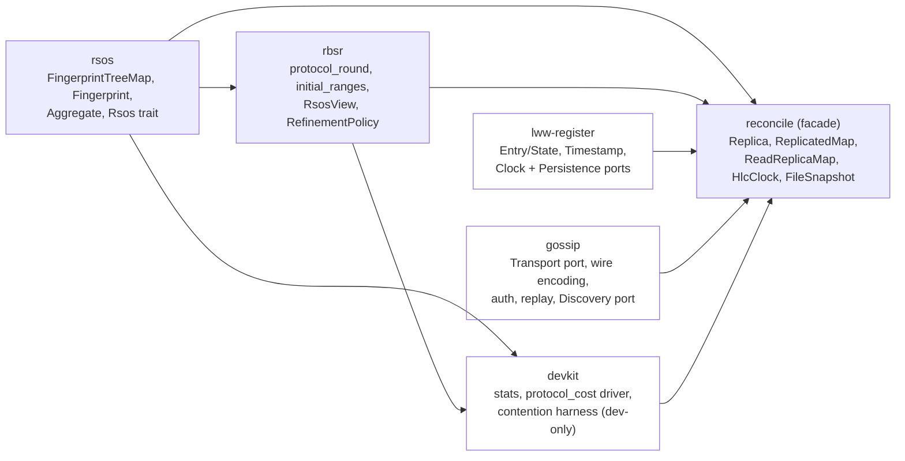
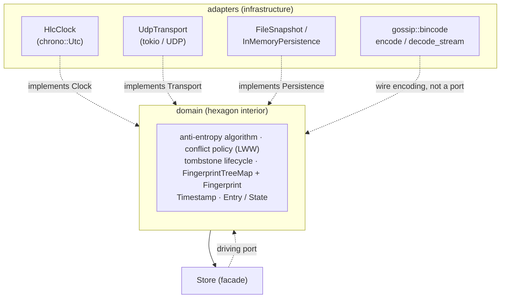
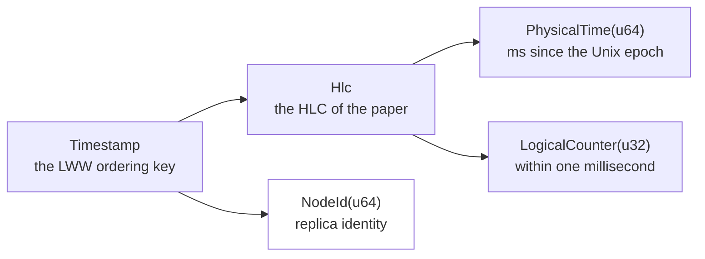
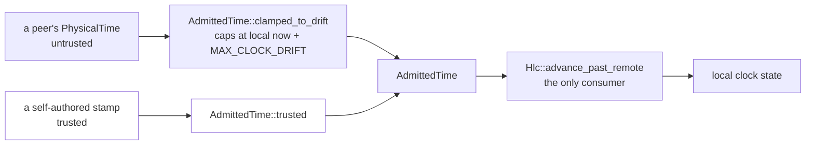

# reconcile-rs — Architecture

## Status & scope

`reconcile-rs` is a reconciliation service that keeps a key-value map synchronised across several
instances. This document describes the architecture as it stands today — a completed hexagonal
(ports & adapters) split into five crates. Correctness and security properties are tracked below
(§8); state-of-the-art positioning is in [`POSITIONING.md`](./POSITIONING.md). Code locations are given as
`file:line` against the current tree.

The public API and the on-wire / on-disk formats are pre-1.0 and may change. Only `reconcile` is
published, and that published version predates this workspace split — current publish status and
the release gate list are tracked live by the `v1.0.0` milestone and
[issue #206](https://github.com/Akvize/reconcile-rs/issues/206), which owns the plan and the
reasoning.

---

## 1. System overview

A node holds an ordered key-value map and gossips changes to its peers so that all replicas
converge. Five mechanisms:

- **Storage** — `FingerprintTreeMap`: an ordered map that also maintains, for every subtree, a
  **range fingerprint**, so the hash of any key interval is available in `O(log n)`.
- **Anti-entropy protocol** — two peers compare aggregates over shrinking key ranges (`rbsr`'s
  `protocol_round`) and exchange only the entries that actually differ. Equality and emptiness are
  decided by interval **size**, not by hash, to stay collision-safe. *How* a range is refined —
  when to stop splitting and how wide to cut — is a `RefinementPolicy`, a purely local choice that
  never reaches the wire (§3.1); the default splits into the paper's constant `b` = 16.
- **Causality & conflict resolution** — each value is stamped with a Hybrid Logical Clock timestamp
  (`Timestamp`); conflicts resolve by **last-write-wins** over the HLC total order
  `(physical, logical, node_id)`.
- **Deletion** — removals are **tombstones**, garbage-collected only once causally stable (every
  monotonic cluster member has acknowledged the exact version), which prevents resurrection.
- **Transport & security** — messages travel as authenticated UDP datagrams (per-datagram MAC,
  verified before deserialisation). Persistence to disk is optional.

---

## 2. Crates and modules



`gossip` deliberately does **not** depend on `lww-register`: nothing in transport/auth/replay/
discovery knows what an `Entry`, `Timestamp` or `Key` is — a datagram is a byte slice, a peer is an
address. `reconcile` is the one place the two meet.

`devkit --> reconcile` is a **dev-dependency** edge only: `benches/protocol.rs`/`contention.rs`
consume it, the `reconcile` library itself never does — see §2.1.

| Crate | Holds | Kind |
|---|---|---|
| `rsos` | `fingerprint_tree_map{,_iter}.rs`, `fingerprint.rs`, `encoding.rs`, `aggregate.rs`, `rsos_trait.rs` | leaf, zero workspace deps |
| `rbsr` | `protocol.rs` (the driver), `policy.rs` (the refinement-policy seam), `rsos_view.rs` | depends on `rsos` only |
| `lww-register` | `entry.rs`, `bounds.rs`, `clock.rs` (`Hlc`/`Timestamp`/`Clock`), `persistence.rs` (`Persistence`/`PersistedState`) | **domain**, infrastructure-free |
| `gossip` | `transport.rs`, `bincode.rs`, `auth.rs`, `replay.rs`, `discovery.rs`, `gen_ip.rs` | infrastructure; no `lww-register` dep |
| `devkit` | `stats.rs` (bootstrap statistics), `protocol_cost.rs` (`Cost`/`Counting`/`reconcile` driver), `contention.rs` (N-writer harness) | dev/bench-only, never published (#524); depends on `rsos`/`rbsr` only |
| `reconcile` | `replica.rs`, `replicated_map.rs`, `read_replica_map.rs`, `clock.rs` (`HlcClock` adapter), `snapshot.rs` (`FileSnapshot`), `observability.rs`, `prometheus.rs`, `timeout_wheel.rs` | facade; depends on all four, re-exports their public types under `reconcile::*` |

`reconcile` keeps re-export shims (`src/persistence.rs`, `src/clock.rs`, `pub use` in `src/lib.rs`)
so `reconcile::entry::Entry`, `reconcile::transport::UdpTransport`, `reconcile::FileSnapshot` and
friends resolve unchanged for existing consumers. `FileSnapshot` briefly had its own crate
(`snapshot`) and was folded back into `reconcile` as `src/snapshot.rs`: a single type with no reuse
value outside this workspace does not earn a crate boundary the way `rsos`/`rbsr` (genuinely
reusable) or `lww-register`/`gossip` (compiler-enforced purity, §2.1) do.

### 2.1 Domain purity

`lww-register`'s manifest declares exactly one dependency, `serde`'s derive — no async runtime,
socket, wire codec or wall clock can be imported there; the build fails rather than the boundary
rotting. `rsos` and `rbsr` carry the same guarantee via their own minimal manifests. This is the
interior of the hexagon, and it exists today, gated by `./scripts/check-domain-purity.sh`
(mechanics: AGENTS.md §9). `gossip` and `reconcile` are adapters and carry infrastructure
dependencies by design. `devkit` is neither domain nor adapter — a dev/bench-only sibling the check
does not cover at all (not in its manifest list, not shipped, #524) — the same exemption `gossip`
and `reconcile` already have, for the same reason: nothing here is claiming purity for it.

### 2.2 Persistent RSOS snapshots

`FingerprintTreeMap` is a persistent, structurally-shared B-tree. Its root and child links are
`Arc<Node<...>>`; cloning the map is an `O(1)` root refcount increment. A mutation follows only the
affected root-to-leaf path and calls `Arc::make_mut`: unshared nodes mutate in place, while nodes
still reachable from an older snapshot are copied before modification. Cached subtree `Aggregate`s
therefore belong to the same immutable version as the keys and values they summarize.

The facade publishes immutable roots through `ArcSwap`. `Replica` owns the dated tree and its
value-only projection as separate `ArcSwap<FingerprintTreeMap<...>>`; `ReadReplicaMap` uses the same
shape for its projected tree. Writers serialize the `load_full -> clone root -> COW mutation ->
store` sequence with a mutex so the dated tree, projection and tombstone side effects advance as one
logical mutation. That mutex is write-side only: readers call `load_full()` and own an `Arc`, so they
take no read lock and never pin a writer. `ArcSwap::rcu` is deliberately not used because an
optimistic retry could replay the projection/tombstone side effects.

`ReplicatedMap::snapshot` / `value_snapshot` and `ReadReplicaMap::snapshot` expose the whole
immutable root for zero-copy iteration and range scans. Point reads use a narrower handle:
`FingerprintTreeMap::get_owned` performs one tree descent, clones only the `Arc<Node>` containing the
matched slot, and `ValueRef` owns that node plus the slot. Dereferencing is `O(1)` and an old
`ValueRef` continues to observe its old value after a concurrent overwrite or deletion.

The architecture gate in [issue #29](https://github.com/adriendellagaspera/reconcile-rs/issues/29)
accepted the measured trade-off. At 100k entries, direct tree reads were ~1.05× the pre-COW cost,
overwrite ~1.11×, insert+remove ~1.10×, range aggregate ~1.14×, bulk load ~1.07× and cold sync
~1.10×; retained versions produced no measurable RSS increase through 64 snapshots in the 1M-entry
runner test. The first public `get` implementation was an outlier at ~2.54× because it searched the
tree twice. The merged point-read repair removed that second descent; the final same-runner result
was 57.224 ns versus 47.758 ns pre-COW (+19.8%).

---

## 3. Ports & adapters

### 3.1 Principle

The domain — storage, protocol, causality, conflict resolution, tombstone lifecycle — depends only
on a small set of **ports** (traits) it defines itself. **Adapters** implement those ports against
concrete infrastructure. All dependency arrows point inward: adapters depend on the domain, never
the reverse. Ports are public and reveal intent; mechanism (how a diff round is computed, how a
range hash is queried) stays internal to its owning crate.



### 3.2 Ports

Four outbound ports, each removing one concrete infrastructure dependency from the domain:

| Port | Crate | Replaces | Adapter(s) |
|---|---|---|---|
| `Clock` | `lww-register/src/clock.rs` | direct `chrono::Utc` read | `HlcClock` (`src/clock.rs`) |
| `Transport` | `gossip/src/transport.rs` | `tokio::net::UdpSocket` | `UdpTransport`, `InMemoryTransport`; dev-only decorators over either — `CountingTransport` (`benches/system.rs`), `NetemTransport` (`gossip/src/netem/`, `netem` feature: seeded delay/jitter/loss/reordering, #280) |
| `Persistence` | `lww-register/src/persistence.rs` | ad hoc file I/O | `FileSnapshot`, `InMemoryPersistence` |
| `Discovery` | `gossip/src/discovery.rs` | inline IP-scan | `RandomProbe` (speculative), `DnsDiscovery` (authoritative) |

`Clock` returns the concrete `Timestamp` rather than a generic associated type: it is the only stamp
in use, and the tombstone wheel and wire format are already coupled to its shape. `Transport` is
`#[async_trait]` and object-safe (`Arc<dyn Transport>`), fixed to `SocketAddr` rather than carrying
a generic `Addr` — every call site hard-wired that anyway, so the associated type was dead freedom
(#287). `InMemoryTransport`/`InMemoryNetwork` are public (not test-gated) so downstream crates can
drive a deterministic in-process cluster in their own tests. `Discovery::discover` reports failure
as a boxed `DiscoveryError`, so an implementor is free to define a richer error taxonomy
(`DnsDiscovery`'s `DnsDiscoveryError` distinguishes a resolver failure from a lookup that blew its
timeout budget) without giving up the `Arc<dyn Discovery>` trait object every call site relies on.
`Discovery::kind` distinguishes a speculative probe result (steers only the current round's targets)
from an authoritative one (seeded into the known-peer set, an absence decommissions after a grace
period) — either way discovery never grants causal-stability membership (§5 invariant 6), which a
peer must earn via an authenticated dated datagram.

**Wire encoding is not a port.** `gossip::bincode::{encode, decode_stream}` are plain `pub fn`s (no
trait, no adapter type) — the crate owns exactly one implementation and has no test-driven need for a
second (`bincode.rs`'s own tests call them directly, no fake). `decode_stream` carries a `max_items`
cap so one datagram cannot be expanded into an unbounded number of messages. Authentication
(`Authenticator`/MAC) wraps the codec externally, verified on raw bytes before any decoding runs
(§5 invariant 5) — never folded in.

**`RefinementPolicy` is a strategy, not a port.** `rbsr::RefinementPolicy` is a trait, and every
port here is a trait, but it removes no infrastructure dependency: it sits *inside* the hexagon and
varies a domain decision — for one active range, SKIP, IDLIST or SPLIT, and how wide a SPLIT cuts.
It earns a seam for a different reason than a port does: the choice is **purely local and never
negotiated**. A peer answers whatever segmentation it is asked about, `RangeAggregate` carries no
policy, and Proposition 4.1's soundness argument uses only that a SPLIT's children are pairwise
disjoint with union the parent — which `protocol_round` guarantees regardless of policy. So two
peers running *different* policies converge (`tests/proptest_fingerprint_tree_map/diff_convergence.rs`'s
`convergence_holds_under_any_policy_and_any_mixed_pair`, and `rbsr`'s own
`peers_running_different_policies_still_converge`), which is what makes swapping one cheap.
Advertising or negotiating a policy would turn that free experiment into a protocol break, and is
the one thing this seam must never grow ([#257](https://github.com/Akvize/reconcile-rs/issues/257)).

**`Clock` injection ([#288](https://github.com/Akvize/reconcile-rs/issues/288), decided: open it).**
`Clock` was a published port with zero public implementors and no injection seam — advertising a
capability that did not exist. Resolved by opening it:
`ReplicatedMap::new_with_clock`/`Replica::new_with_clock` accept any `Arc<dyn Clock>`, and
`lww_register::clock::assert_conformance` (re-exported as `reconcile::clock::assert_conformance`)
is the conformance harness an implementor runs before trusting a substitute clock — monotonicity is
a runtime property of an arbitrary implementation, not something the type system can gate, so a
runtime check an implementor must run is the closest thing to a gate available. `Clock::observe_trusted`
has no default body (previously delegated to `observe`, sound only for a clamp-free adapter): every
implementor now states its clamp policy explicitly. Both constructors' rustdoc carries the full risk
writeup — what a non-monotonic `now()`, an `observe` not chased by `now() > t`, or a clamping
`observe_trusted` each silently break.

**Visibility.** `Clock`/`Transport`/`Persistence`/`Discovery` are public ports on their owning
crate. What the mechanism behind them exposes, and to whom:

| item | `pub` on | re-exported by `reconcile` |
|---|---|---|
| `Clock` / `Transport` / `Persistence` / `Discovery` | owning crate | yes — the ports are the seam |
| `rank` / `select` / `range` | `rsos` | no |
| `protocol_round` / `protocol_round_with_policy` / `initial_ranges` | `rbsr` | no |
| `RangeAggregate` / `EnumerationRange` / `RoundOutcome` / the `RefinementPolicy` seam | `rbsr` | no |
| `bincode::{encode, decode_stream}` | `gossip` | no |

The right-hand column is not an oversight: `rsos` and `rbsr` are published-intent, reusable crates
(AGENTS.md §11), so their primitives are `pub` for a consumer depending on them directly, while
`reconcile`'s own surface stays the facade. `gossip::bincode` is `pub` for the narrower reason that
`reconcile` must reach it across a crate boundary.

Two consequences follow, and both are decisions rather than accidents:

| | |
|---|---|
| Injecting a `RefinementPolicy` is an `rbsr`-level operation | `reconcile`'s `Config` is `Copy` (the fixed-size `nets` array exists to keep it so), which a boxed or borrowed policy would break. What the facade should expose wants the measured comparison first — `POSITIONING.md` §2.2 |
| `Codec` was considered and dissolved as a trait | one implementation; no object-safety need (its methods are generic, always carried as a type parameter); no plausible second use — compression interacts with authenticate-before-decode, and cross-language interop needs a published wire spec, not a Rust trait |

---

## 4. Domain types and conflict policy

A single, intention-revealing type represents a stored cell:

```rust
pub struct Entry<T, V> { pub stamp: T, pub state: State<V> }
pub enum State<V> { Present(V), Tombstone }

impl<T: Ord + Copy, V: Clone> Entry<T, V> {
    pub fn is_tombstone(&self) -> bool { matches!(self.state, State::Tombstone) }
    pub fn value(&self) -> Option<&V> { /* … */ }
    pub fn merge(&self, other: &Self) -> Self {        // last-write-wins (strict >)
        if other.stamp > self.stamp { other.clone() } else { self.clone() }
    }
}
```

`Entry::project(&self) -> State<V>` gives the timestamp-less value-only projection `ReadReplicaMap`
converges over — `State<V>` already has no `Timestamp` field, so no field-by-field summary of it can
include one (§5 invariant 8).

`T` is, in practice, always `Timestamp` — built from newtypes and split along the seam between
*reading a clock* and *ordering writes*:

```rust
pub struct Hlc { physical: PhysicalTime, logical: LogicalCounter }  // the HLC of the paper
pub struct Timestamp { hlc: Hlc, node_id: NodeId }                  // the LWW ordering key
pub struct PhysicalTime(u64);    // HLC physical time: an instant, ms since the Unix epoch
pub struct LogicalCounter(u32);  // HLC logical counter, within one millisecond
pub struct NodeId(u64);          // replica identity — the deterministic tie-break
pub struct ClockDrift(u64);      // a *duration*, never comparable to an instant
```



The split is where it is because a Hybrid Logical Clock (Kulkarni et al. 2014) *is* the pair
`(physical, logical)` — `node_id` is the tie-break that makes the LWW comparison total, not a clock
component. Two consequences:

| | |
|---|---|
| the arithmetic (`Hlc::next_tick`, `Hlc::advance_past_remote`) lives on `Hlc` and takes no `NodeId` | the `Clock` adapter owns the identity and attaches it only when minting a `Timestamp`, so it is stored once rather than as both a field and part of a stored clock reading |
| nesting costs nothing on the wire | bincode and `rsos`'s canonical encoding (§6) both write a struct as its fields in declaration order with no framing, so `{{physical, logical}, node_id}` is byte-identical to a flat triple — pinned by `tests/timestamp_wire_format.rs` |

`Timestamp` is built through one further "parse, don't validate" type, `AdmittedTime` — the past
participle is the point: the type is evidence the drift check *has run*. There are exactly two ways
in, and `Hlc::advance_past_remote` accepts nothing else, so the clamp is a property of the type
system rather than of a parameter name (§5 invariant 6 depends on this):



That clamp guards the *local clock state* only — a remote stamp is stored verbatim, since it is LWW
data. `reconcile::clock`'s `BoundedInstant` performs the one further derivation that needs bounding:
the tombstone-expiry instant, re-admitting the stored `PhysicalTime` through the same
`clamped_to_drift` seam against local now (`reconcile`'s `HlcClock` adapter, since it needs both a
physical-time read and a `chrono` instant — the domain crate has neither).

`Entry` and `AdmittedTime` are the same "parse, don't validate" shape as
[`Payload`](gossip/src/auth.rs) (only obtainable via `Authenticator::open`): construction of an
invalid instance is either structurally impossible or funneled through one fallible constructor.

Conflict resolution is **domain policy**, not a port: last-write-wins is the concrete default. A
pluggable `Resolve` seam is warranted only if a second policy (e.g. a CRDT) becomes a real
requirement.

**No cluster-wide conditional write** ([#26](https://github.com/adriendellagaspera/reconcile-rs/issues/26),
decided). `compare_and_swap`/`insert_if_absent` are unsound over AP + LWW + no consensus: two nodes
can each observe the expected value, each swap, and LWW picks one by timestamp rather than
rejecting the loser — the exact race such a method exists to prevent. README "Conflict resolution"
records the decision; `get_or_insert_with`/`upsert` (`src/replicated_map/mutate.rs`) document the
atomicity they do provide (node-local, against this replica's own reconciliation loop, not
cluster-wide).

### 4.1 Generic bounds

```rust
pub trait Key:   Clone + Debug + Ord + Send + Sync + Serialize + DeserializeOwned + 'static {}
pub trait Value: Clone + Debug + Send + Sync + Serialize + DeserializeOwned + 'static {}
```

Neither bundle carries `Hash` (fingerprints derive from `Serialize` via `rsos::encoding`, §6, not
`std::hash::Hash` — which `HashMap`/`HashSet` don't implement at all) or `PartialEq` (the receive
path's only "did this change?" question is a stamp comparison, `Entry::merge` returns `other` exactly
when the remote stamp is strictly greater, so `Timestamp: Ord` answers it without ever comparing —
or cloning — the value). The remaining `Hash` bounds in the facade are genuine `HashMap`-key
requirements, spelled out locally where the `HashMap` is (`ReplicatedMap`/`Replica`'s peer and
tombstone indexes, `TimeoutWheel`, the snapshot codec).

---

### 4.2 State typing

A finite, named set of states carried by a **type** rather than by an `Option`, a `bool` or a bare
primitive, so the state is a compile-time fact instead of call-site discipline. AGENTS.md §4 states
the rule; these are its worked instances, and the reference examples to copy:

| Type | What its existence proves | Obtained by |
|---|---|---|
| `Entry` / `State<V>` (`lww-register`) | a dated cell vs its timestamp-less projection (§5 inv. 8) | `Entry::project` |
| `StartBound` / `EndBound` (`rbsr`) | the two bound shapes the protocol emits — the other two `Bound` variants fail to deserialize rather than reaching the driver | wire decode |
| `Payload<Authenticated>` / `Payload<Verified>` (`gossip`) | MAC-checked, then replay-checked; message handling takes `Verified`, so an unchecked datagram cannot reach it | `Payload::verify_replay` |
| `AdmittedTime` (`lww-register`) | a peer's physical time was clamped to the drift budget before touching local clock state | `AdmittedTime::clamped_to_drift` |

**Newtype or phantom parameter?** Decide by whether the *pre*-state travels. `Payload` earns its
parameter: both states are held, passed, and demanded in a signature. `AdmittedTime` does not — its
raw form is consumed where it is produced, so a phantom would add a type parameter to every
signature to distinguish a state nothing carries. Prefer the newtype until a second state is
genuinely held across a boundary.

The 2026-08 sweep for this pattern is closed. Both items it left open have since been resolved in
the direction it recommended: `Authenticator`'s `is_enabled`/`is_encrypted` booleans are gone (call
sites `match` the enum, which was already a well-typed state), and `Discovery::is_authoritative() ->
bool` became `kind() -> DiscoveryKind`.

### 4.3 Read views and snapshot semantics

The user-facing maps expose three ownership shapes over the same persistent core:

| API | ownership | semantics |
|---|---|---|
| `get(&K) -> Option<ValueRef<...>>` | matched persistent node | one lookup; zero-copy access that remains valid across later writes |
| `get_cloned(&K) -> Option<V>` | owned `V` | one lookup + value clone; no persistent read handle |
| `snapshot()` / `value_snapshot()` | `Arc<FingerprintTreeMap<...>>` | `O(1)` root snapshot; `iter`/`range` borrow directly with no lock held |

`ReplicatedMap` stores dated `Entry<Timestamp, V>` in one persistent tree and keeps a timestamp-less
`State<V>` projection in a second; `ReadReplicaMap` stores only that projection. One read operation
therefore sees one immutable version. A writer may publish a newer root while the read is running,
but cannot mutate nodes still owned by that read. This is both the facade's lock-free zero-copy
read contract and the coherent-snapshot discipline used by reconciliation rounds.

The writer mutex is intentionally not a reader/writer lock: it serializes logical mutations so the
dated tree, value projection and tombstone bookkeeping remain consistent. Multi-writer aggregate
schemes are a separate concern; the persistent snapshot architecture solves reader/writer
contention without weakening the existing write-side invariants.

---

## 5. Invariants

Load-bearing properties preserved across any change; they encode the correctness and security
guarantees whose resolution history §8 tracks.

1. **Fingerprint format & arithmetic** — `[u64; 4]`, per-element BLAKE3 over `rsos::encoding`'s
   injective byte encoding (not `std::hash::Hash`, whose byte sequences Rust does not stabilize —
   and which `HashMap`/`HashSet` don't implement), add/sub mod 2²⁵⁶. Both halves are load-bearing:
   changing the encoding is as much a wire break as changing the hash. Golden vectors in
   `rsos/src/fingerprint.rs`. On the wire, `Serialize`/`Deserialize` go through raw `[u8; 32]` rather
   than deriving over the four `u64` limbs — a uniformly random 256-bit value gets nothing from
   `bincode`'s default varint integer encoding except a length byte per incompressible limb (#382,
   decided before the wire freeze).
2. **HLC total order** `(physical, logical, node_id)` — merge uses strict `>`. Composed of two
   derived orders, `Hlc` over `(physical, logical)` then `Timestamp` over `(hlc, node_id)`; the
   newtype declaration order *is* the conflict order, and `tests/timestamp_wire_format.rs` pins that
   neither the newtype wrapping nor the `Hlc` nesting costs anything on the wire.
3. **Size-not-hash emptiness/equality** in `protocol_round` (`rbsr/src/protocol.rs`) — owned by
   `Comparison::agrees`, so a swapped `RefinementPolicy` cannot re-derive it wrongly.
4. **Malformed-bound / inverted-range hardening** in `protocol_round`.
5. **Authenticate before deserialise** — the MAC is verified on raw bytes before the codec runs;
   `decode_stream` never absorbs authentication.
6. **Causal-stability tombstone gate** — a tombstone is garbage-collected only after every monotonic
   cluster member has acknowledged the exact version hash. `Discovery` only ever feeds the
   gossip-target `peers` set, **never** the `members` set: membership is earned solely by an
   authenticated dated datagram, so a discovered (unverified) address can neither block GC nor be the
   subject of a GC release. The wall-clock half of the lifecycle — the instant a tombstone ages
   from — is bounded via `AdmittedTime::clamped_to_drift` (§4) against local now, so a peer cannot
   date a tombstone past every plausible expiry and pin it in the map forever; the stored stamp
   itself is never rewritten.
7. **`version_hash` determinism** (`replica.rs`) — the low 64 bits of `rsos::digest`, the same
   canonical encoding fingerprints use, deterministic across toolchains (not merely across nodes on
   one).
8. **Value-only projection summary is timestamp-less** — `Entry` summarizes with its `stamp`
   (feeding `version_hash`); its `State<V>` projection has no timestamp field at all, so a dated
   store and a dateless `ReadReplicaMap` compute identical per-element fingerprints. Guarded by
   `read_replica_map.rs::value_fingerprint_is_timestamp_independent`.
9. **The RSOS contract is defended, not trusted** — structurally, per §4: backend ranks become a
   `AdmittedRank` clamped to that backend's `size()`, and the fan-out advances only through
   `AdmittedRank::cut_before`, so the single `select` into a foreign backend cannot receive an
   out-of-range position. The laws are stated where they are enforceable — inter-method laws on
   `rbsr`'s `RsosView` (with an enforcement column), the interop law on `rsos::Rsos::aggregate`.
   Guarded by `no_backend_answer_can_drive_the_protocol_out_of_bounds`
   (`tests/proptest_fingerprint_tree_map/adversarial_rsos.rs`) and, as a worked example,
   `rbsr/src/protocol.rs::backend_with_unclamped_rank_is_defended_against_not_trusted`.
10. **A SPLIT's children partition their parent** — consecutive, pairwise disjoint, union the parent
   range — whatever `RefinementPolicy` chose the width, and whatever policy the *peer* is running.
   This is what Proposition 4.1's soundness argument rests on, and therefore the reason the policy
   can stay a local, un-negotiated choice (§3.1). Guarded by
   `rbsr/src/protocol.rs::split_children_partition_the_parent_range` and, across mixed policy pairs,
   `peers_running_different_policies_still_converge`.
11. **A wire-version mismatch is diagnosable, never silently misread** (#309) — `gossip::auth`
   stamps every datagram with a version byte inside the authenticated/encrypted region (present
   even unauthenticated, since that is the default), checked by `Payload::check_version` between
   `Authenticator::open` and `Payload::verify_replay` (invariant 5's ordering, extended). A
   mismatch is rejected with a distinguishable, counted reason
   (`reconcile_datagrams_dropped_total{reason="version"}`), not folded into "malformed" or
   "bad_mac". No accepted-version window exists today — README "Wire versioning" states the
   operational consequence. Guarded by `tests/wire_format.rs`'s envelope vector and
   `mixed_wire_versions_are_reported_not_silently_dropped`.
12. **A `RefinementPolicy` cannot see a fingerprint** (#352) — the skip rule's soundness bound
   unions a per-comparison collision probability over the ranges an execution compares, legal only
   because those ranges are cut by rank (`Select`), a function of the data alone; a policy that cut
   by a fingerprint byte instead would void that bound silently. `rbsr::Comparison` exposes
   `span()`/`remote_size()`/`agrees()`/`children_emitted()` only — no accessor returns a
   fingerprint or a full `Aggregate` — so the violation is structural, not merely documented.
13. **A `RefinementPolicy` cannot stall the driver** (#420) — `RefinementPolicy`'s progress law is
   that a `Decision::Split` for `span() > 1` must choose a stride below the span; a stride at or
   above it emits one child equal to the parent, legitimate only for `span() <= 1` (`Decision::Split`'s
   docs, invariant 10's partition argument). `protocol_round_with_policy` does not trust a
   plugged-in policy to hold that: a `Split` for `span() > 1` that would not narrow the range is
   converted to an `Enumerate` before it reaches the fan-out loop, so every span a policy actually
   splits strictly shrinks and no range can loop on a content-determined fixed point. The
   oracle-coupled probe that motivated it (#356) hung on ~99.5% of drives before this guard existed
   and converged 200,000/200,000 at both widths afterward. Guarded by
   `rbsr/src/protocol.rs::non_progressing_split_is_converted_to_enumerate`, the `NeverNarrows`
   policy exercised through the same convergence matrix as every shipped policy, and pinned for the
   shipped policies themselves by `rbsr/tests/shipped_policies_always_progress.rs`.
14. **A message at a reserved wire tag never blocks the rest of its datagram** (#463) — an unknown
   message at a reserved tag decodes as opaque `Vec<u8>` and is ignored by `handle_messages`, so a
   peer that does not yet assign real meaning to that tag still processes every other message the
   same datagram carried, rather than dropping it whole the way an unrecognized tag past 6 does.
   Narrow by construction: two tags, once each. Tag 5 has since been consumed by
   `Message::ConvergenceAck` (#23) — a comparison round that converges with nothing else to
   report — at the cost of `WIRE_VERSION` 2 → 3, a normal pre-1.0 minor-version release
   (`CHANGELOG.md`/`MIGRATING.md`; `akvize/reconcile-rs#382` did the same for `Fingerprint`'s
   encoding), not a live-migration mechanism: `akvize/reconcile-rs#309` is the wire-version byte's
   own origin (invariant 11), and its consequence — a mismatched peer's whole datagram rejected, no
   accepted-version window — is what makes *any* bump a full-drain, no-mixed-versions rollout once
   a real cluster exists, same as every bump before it. `Message::Reserved6` is the one tag still
   reserved; consuming it, or adding a seventh, needs another such bump. Guarded by
   `src/replica/tests/reserved_wire_tags.rs::a_reserved_message_does_not_block_the_rest_of_the_datagram`
   (now exercised via tag 6) and its siblings pinning tag 6's own encoding and opaque payload's
   bounded decode, plus `src/replica/tests/convergence_ack.rs` for tag 5's own encoding and the
   ack-on-converged-round behavior.
15. **A failure triggered by caller-supplied data returns `Result`; it does not panic** (#95) —
   decided as Option B of #95: this crate is a networked, embeddable library that does not fully
   control the shape or size of the data reaching it (config, discovery-supplied peer info,
   persisted state, a caller-chosen key), so panicking on it is a self-inflicted DoS surface, not a
   caller bug — the same reasoning #82 gave for `try_insert`/`try_update` (F13), generalized instead
   of repeated ad hoc per method. New public API must return `Result` from the start, as the sole
   entry point — a panicking convenience plus a `try_` twin is exactly the halfway state this
   decision retires, not a legitimate resting point, so an existing pair converts to one
   `Result`-returning method rather than gaining a permanent twin. This does not extend to a missing
   ambient Tokio runtime (an environment precondition, documented as `# Panics`), an internal
   "provably impossible" assertion (HLC monotonicity, mutex poisoning), or an index-style panic
   (`Rsos::select`, `FingerprintTreeMap::select`) — those mirror `Vec`'s own `[]` vs `.get()` split,
   Rust's own convention, not this crate's to relitigate. Disposition of #95's audit:
   - `Config::with_net`/`with_nets` (`src/replicated_map/config/builders.rs`) — converted by #97:
     both now return `Result<Self, ConfigError>` directly; the panicking wrappers and the
     `try_with_net` twin are gone, one entry point each, matching this invariant's "no new `try_`
     twin should ever be needed again" — extended here to existing API too, since a twin pair is
     exactly the halfway state this decision exists to retire. `M-breaking`; every call site in
     this workspace (~70, all test/bench/example code) updated to `?`/`.unwrap()`.
   - `ReplicatedMap::with_discovery` (`src/replicated_map/discovery.rs`) — converted by #98:
     returns `Result<Self, NotAuthoritative>` directly instead of panicking on a `Speculative`
     `Discovery::kind()`; no `try_with_discovery` twin remains. `M-breaking`;
     `ReplicatedSet::with_discovery` (a thin wrapper) converted the same way, and
     `with_dns_discovery` stays infallible since `DnsDiscovery::kind()` is unconditionally
     `Authoritative` by construction.
   - `with_persistence`'s load path (`src/replicated_map/persistence.rs`,
     `src/replicated_set.rs`) — resolved by #99: converted outright to
     `Result<Self, PersistenceLoadError>`, replacing `PersistenceLoadError::{Corrupt,RetriesExhausted}`
     panics; no `try_with_persistence` twin was added, and none remains. This one *is* genuine
     runtime data: a corrupted or retry-exhausted disk state is an environmental fact discovered at
     startup, not a static developer mistake — closer to `insert`/`update`'s DoS surface than to
     `Config::with_net`'s static cap. The load loop's synchronous `std::thread::sleep` backoff was
     reconsidered alongside this change and kept: making it async would require an `async fn`
     `with_persistence`, a load-bearing signature change to every builder-chain caller, entangling
     an orthogonal concern with this one — tracked separately if ever taken on.
   - `Authenticator::new`/`with_rotation` (`gossip/src/auth/key.rs`) — resolved by #100: converted
     outright to return `Result<Self, EncryptionFeatureDisabled>` instead of panicking when
     `encrypt = true` without the `encryption` feature. No `try_new`/`try_with_rotation` twin was
     added, and none remains — even though the mismatch is a build-configuration fact checked once
     at startup (which Cargo features this binary was compiled with), not runtime data a peer or
     attacker ever influences, the resting point this invariant settled on is one fallible method,
     not a panicking one kept alongside a fallible twin.
   - `check_key_or_insecure_opt_in` — kept as-is: it is the loud, deliberate security guard #325
     chose specifically so a cluster cannot start unauthenticated by silent default; a `Result` a
     caller can inspect-and-ignore is exactly the footgun #325 was written to close, not a
     data-shape failure this decision is about.

---

## 6. The canonical encoding

A `Fingerprint` is a wire token: "the same element gives the same 256 bits everywhere, forever" has
two halves, and both are owned by `rsos`. Pinning the *hash function* to BLAKE3 is only the first;
the second is the byte stream fed into it. `rsos::encoding` is a `serde::Serializer` writing an
injective, length-prefixed byte stream straight into BLAKE3:

| Rust shape | wire encoding |
|---|---|
| integers | fixed-width, little-endian |
| `str` / `[u8]` / sequences | `u64` length prefix, then the elements |
| enums | `u32` variant index, then the payload |
| structs | fields in declaration order, names omitted |
| maps | entries **sorted by encoded key** — what makes a `HashMap` summarize identically to a `BTreeMap` holding the same entries |

It adds no dependency (`serde` was already there) and no codec crate, so `rsos` stays the
zero-infrastructure leaf §2.1 requires. `lift(&k, &v)` is that encoding of key then value; `digest`
is the single-value form `version_hash` uses.

This replaced deriving fingerprint bytes from `std::hash::Hash`, whose per-impl byte sequences Rust
does not stabilize (a future `Hash for str` would move every fingerprint in every cluster) and which
`HashMap`/`HashSet` don't implement at all. The move was a wire-format break: every element
fingerprint changed, so a node on the new encoding and one on the old never agree on a range and
re-exchange indefinitely. It shipped before any release tag for exactly that reason.

---

## 7. Extension points

Extension points are added only when a second real consumer earns the abstraction. The current
architecture therefore keeps several seams deliberately closed rather than publishing speculative
traits before 1.0.

| extension point | current decision | revisit when |
|---|---|---|
| `Transport` | **realized** — UDP plus the in-memory test transport | already justified by two implementations (§3.2) |
| public `Encoding` port | **absent** — the wire has one canonical implementation | a second codec/format has a concrete consumer |
| generic lifting monoid | **deferred to a future major** — `Aggregate` remains count + `Fingerprint` | a real summary type determines whether the bound should be `Monoid` or `Group` |
| multidimensional RSOS | **rejected** for this design | new theory removes the range-aggregation cost that breaks the O(log n) target |
| pluggable value conflict resolution | **deferred** — LWW remains the value contract | a concrete converging value type cannot be expressed by key decomposition |
| leaf sketch beside RBSR | **out of this crate** — decision records #11/#12 | research produces a tested design suitable for the engineering repository |
| partial replication / sharding | **future grid-layer concern** | capacity must exceed one node's RAM while preserving local-read economics |
| correlated false-SKIP defense | **keyed lift + per-session cut randomisation ship** | the residual cluster-key-holder threat needs an additional measured mitigation |
| alternate transport for oversized values | **rejected for the current niche** | a demonstrated workload cannot decompose values into smaller keys |

### Generic summaries

`rsos::Rsos` deliberately exposes the concrete `Aggregate { size, fingerprint }` in the 1.x
surface. Generalising it needs an associated summary type, and the useful bound is still unresolved:
a group preserves today's cheap subtraction on deletion; a monoid admits summaries such as min/max
but requires recomputation up the path. Waiting costs a future major version and is preferable to
freezing the wrong public trait now. The positioning context is
[`POSITIONING.md`](./POSITIONING.md) §2.4.

### Conflict-resolution seam

The current system is an LWW register with HLC ordering (§4). A pluggable merge seam is not added
until a real value type needs it. Large collections should normally be represented as many keys
instead of one CRDT-shaped value; [README "Modelling sets"](README.md#modelling-sets) explains why
that preserves fine-grained reconciliation and reuses tombstone GC.

### Capacity boundary

Full replication is intentional: every node serves reads locally from RAM. A generic disk-backed
`Storage` port would keep the full-replication ceiling while sacrificing that advantage, so it is
not the capacity strategy. If the working set must exceed one node, the architectural direction is a
separate partial-replication/grid layer rather than silently turning the core map into a disk store.

### False-SKIP threat model

The shipped defenses cover two different layers. A cluster key derives the keyed RSOS lift, so a
party without the key cannot precompute a cancelling fingerprint plant. Per-session cut
randomisation changes child boundaries below the outer range. A cluster-key holder still knows the
lift key, and the outer range has no boundary to randomise; an additional periodic-root-refinement
scheme would therefore need its own measured justification before being added. The operational
security contract is canonical in [`SECURITY.md`](SECURITY.md).

### Datagram ceiling

The protocol stays one-datagram UDP. Stream transport, application fragmentation and side-channel
blob storage all add lifecycle or reliability machinery that conflicts with the small-value,
embedded-replication niche. The supported mitigation is to keep values small, optionally enforce an
application ceiling with `Config::max_value_size`, and decompose large collections across keys.

