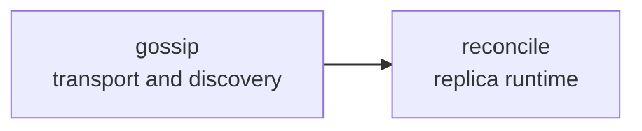

# Architecture

The runtime is an embedded, **fully replicated** LWW map: each authoritative node holds all entries, serves local reads, propagates writes and repairs divergence through range-based anti-entropy. Deletions remain tombstones: physical collection is disabled until obsolete-history admission is fenced. Receipt ACKs alone do not authorize it. `ReadReplicaMap` is a non-authoritative sink, never a source or causal-stability member.

## 2. Boundaries

```mermaid
graph LR
    gossip["gossip\ntransport and discovery"]
    reconcile["reconcile\nreplica runtime"]
    gossip --> reconcile
```

| component | responsibility |
|---|---|
| `rsos` / `rbsr` (external) | ordered range store and reconciliation; `FingerprintTreeMap` adapter |
| `lww-register` (external) | total timestamp order, LWW entries and `HlcClock` |
| `gossip` | byte-oriented transport, authentication, replay, framing and discovery |
| `reconcile` | public replicated map/set runtime, lifecycle, observability and persistence |

`gossip` does not depend on `lww-register`. The default legacy `ReplicatedMap` peers are IP-addressed; the separately constructed, opt-in `SignedReplica<K,V,A>` uses allowlisted and route-confirmed Ed25519 `PeerId` values for its causal membership and exact-version ACKs, independent of arbitrary datagram substrate address `A`. The two runtimes cannot be mixed.

`Transport<A = SocketAddr>` exchanges datagrams using opaque substrate endpoints; those addresses are untrusted routing metadata. `UdpTransport` uses socket addresses, and `InMemoryNetwork<A>` supports arbitrary hashable endpoints with an optional datagram size limit. Neither adapter requires sessions or streams. The signed actor remains caller-driven: provisioned endpoint hints feed `probe`, received source addresses feed `receive`, and returned datagrams pass through the chosen transport. Legacy discovery retains its IP-specific authority/decommission semantics. Signed discovery uses `EndpointDiscovery<A>` hints and a bounded, rotating `EndpointDiscoveryState<A>` schedule; resolver failure, empty snapshots and omissions never modify authenticated routes or causal blockers. Resolution runs separately from the signed actor; `probe_discovered` emits rate-limited hellos and ordinary signed ingress confirms routes. Network emulation accepts substrate-specific `LinkPolicy<A>` implementations; its default `IpLinkPolicy` policy retains IP-based link overrides and seeded streams.

| port | owner | adapters |
|---|---|---|
| `Rsos` / `RsosView` | `rsos` / `rbsr` | `FingerprintTreeMap` |
| `Clock` | `lww-register` | `HlcClock` |
| `Persistence` | `reconcile` | in-memory, `FileSnapshot`, external implementations |
| `Transport` | `gossip` | UDP, in-memory, network emulation |
| `Discovery` | `gossip` | random probes, DNS |

Persistent tree nodes share unchanged structure via `Arc`; `ReplicatedMap` and `ReadReplicaMap` publish immutable roots using `ArcSwap`, so reads and snapshots need not hold the writer lock.

## Persistence and recovery

`Persistence::load/save` exchanges a complete `PersistedState` with generic backends. `FileSnapshot` may instead store incremental generations without changing that port's semantics.

- Durable mutations acquire generation -> write lock -> secondary indexes. Full fallback capture pins the dated root and causal metadata under that boundary, then clones payloads and performs I/O outside it. Retrying a frozen generation never retires newer open writes.
- Each mutation belongs to one generation. Freezing generation `g` isolates it from later writes in `g + 1`; success/failure of `g` cannot retire later writes. Frozen work remains retryable after failure, with at most one generation frozen for publication. Pending mutations in an open generation coalesce.
- `FileSnapshot` uses an immutable base, zero or more ordered immutable deltas, and an atomic authoritative manifest naming the complete contiguous committed chain. Unreferenced segments are ignored.
- Base, delta and manifest formats are versioned and integrity-checked. Recovery validates the manifest, referenced base and every named delta in generation order. Missing, corrupt, duplicated or out-of-order committed segments fail with `InvalidData`; recovery must not silently drop generations or initialize empty state.
- Publication writes and durably syncs data before atomically replacing and durably syncing the manifest. Compaction publishes a fully durable replacement base and manifest **before** deleting obsolete segments. Crashes recover either the previous complete manifest or the new complete manifest, never a partial generation.
- The **legacy v1** single-file snapshot can be migrated into its legacy incremental store at the first successful checkpoint. The signed actor instead uses **v2** RCNL/RCNB/RCND/RCNM and strictly rejects old v1 state or a persisted authoritative-roster mismatch. There is no automatic v1 IP-to-signed-`PeerId` conversion: see [UPGRADE-PEERID.md](UPGRADE-PEERID.md). Unknown/malformed formats fail closed. Downgrading is unsupported.
- Materialization policy must keep retained segment count/bytes, recovery work, and pending dirty state bounded; policy thresholds are not durability contracts.

Persisted state is restored **before** network participation.

## Network framing and admission

The normal legacy UDP datagram budget is 1200 bytes inclusive of authentication/version framing. Legacy ingress validates **authentication → strict wire version → topology admission → replay → bounded recovery/reassembly → protocol decode**. Signed-only ingress additionally verifies the independently allowlisted Ed25519 signer, individual replay state and nonce-confirmed return route *before* allocating fragments or dispatching dated messages. A signed actor's configured MTU includes both signature and inner MAC overhead. Untrusted frames and missing-range controls may not allocate recovery state or mutate domain state before admission.

A frame contains a complete logical message, fragment, or capability-gated selective-recovery control. Support is advertised in the reserved extensible protocol tag; older same-version peers ignore it and use whole-message anti-entropy. Missing-range controls are sent only to peers that advertised support. Receiver and sender state are bounded as described in [`SECURITY.md`](SECURITY.md); ordinary anti-entropy remains the fallback.

## Global invariants

- Authoritative replicas are fully replicated, not sharded; read replicas are sinks.
- Same-key conflicts use deterministic total `Timestamp` order.
- Range equality checks both aggregate cardinality and fingerprint.
- Reconciliation policies are local, not wire-negotiated; non-progressing splits fall back to enumeration.
- Receipt ACKs track **all configured authoritative signers**, including disconnected members. Physical tombstone collection is disabled in both runtimes: neither a receipt quorum, elapsed retention, decommission nor a checkpoint excludes rollback or first delivery of stale application data. Tombstone/ACK memory therefore has no collection bound. Signed readers never count as authorities.
- The signed actor currently runs bounded record-by-record round-robin anti-entropy; the legacy runtime retains its RSOS/RBSR range reconciliation. Deployment-level throughput and reconciliation cadence must not be assumed equivalent.
- Authentication precedes deserialization and protocol handling; wire versions are strictly incompatible.
